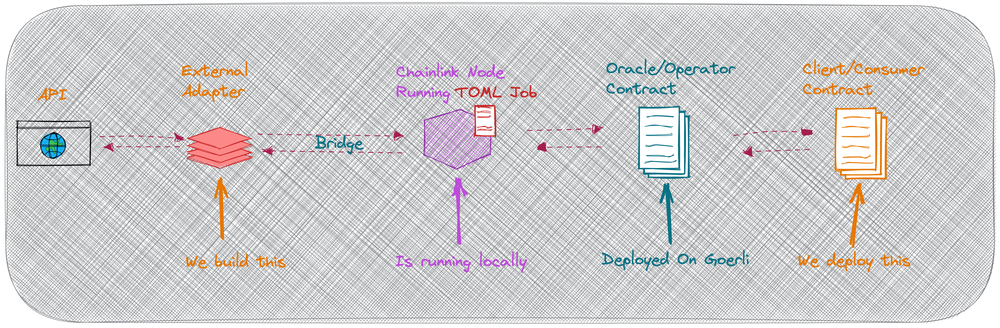

# INTRODUCTION

The project is called W3SO - Web3 Security Oracle - which allows providing the security analysis score on-chain.

# Recommended Prerequisites

1. `docker`
2. `docker pull mythril/myth`
3. `Running Chainlink Node`

# Repo Structure

- `backend-server` - all code regarding EA
- `contracts` - contracts with example usage of oracle

# Getting Started

1. `cd backend-server && yarn` - get into dir and install packages
2. `yarn start` - to start server

## Request Data

`curl -X POST -H "content-type:application/json" "http://localhost:8080/" --data '{ "id": 10, "data": { "address":"0x5c436ff914c458983414019195e0f4ecbef9e6dd" }}'` for the API to run mythril inside docker and return the security score for provided address.

When interacting with a Chainlink Node, the External Adapter will receive a post request that looks something like this:

```
{
  data: { address: '0x123...' },
  id: '0x93fd920063d2462d8dce013a7fc75656',
  meta: {
    oracleRequest: {
     // .... some data ....
    }
  }
}

```

## Response Data

Our external adapter returns data in the following structure ([docs](https://docs.chain.link/docs/developers/#returning-data)). Not all fields are required though.

```
returned response:   {
  jobRunID:10,
  data: {
    result: {
      address: "0x5c436ff914c458983414019195e0f4ecbef9e6dd",
      score: 0.0625
    },
  }
}
```

# Architecture Diagram


